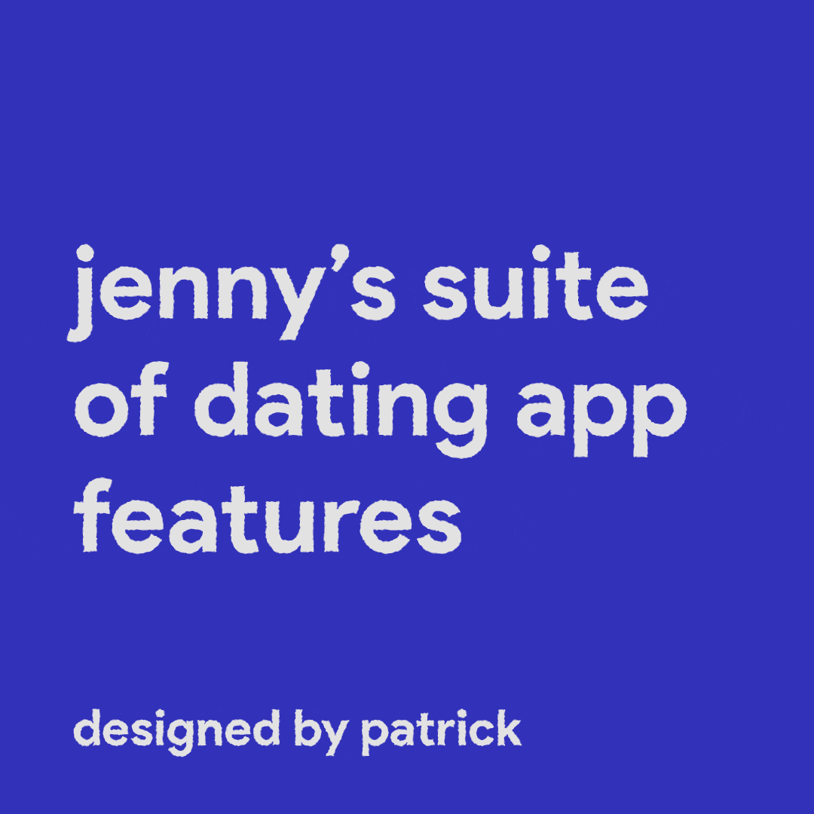
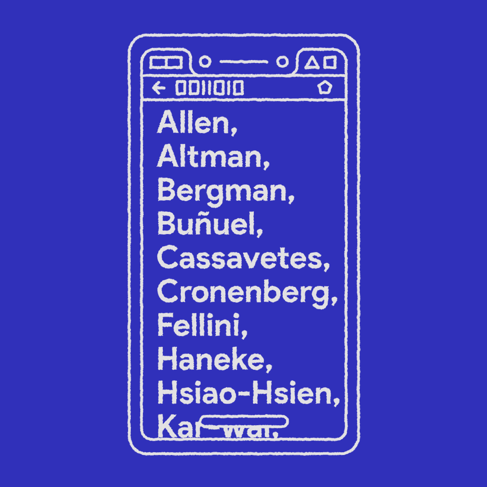
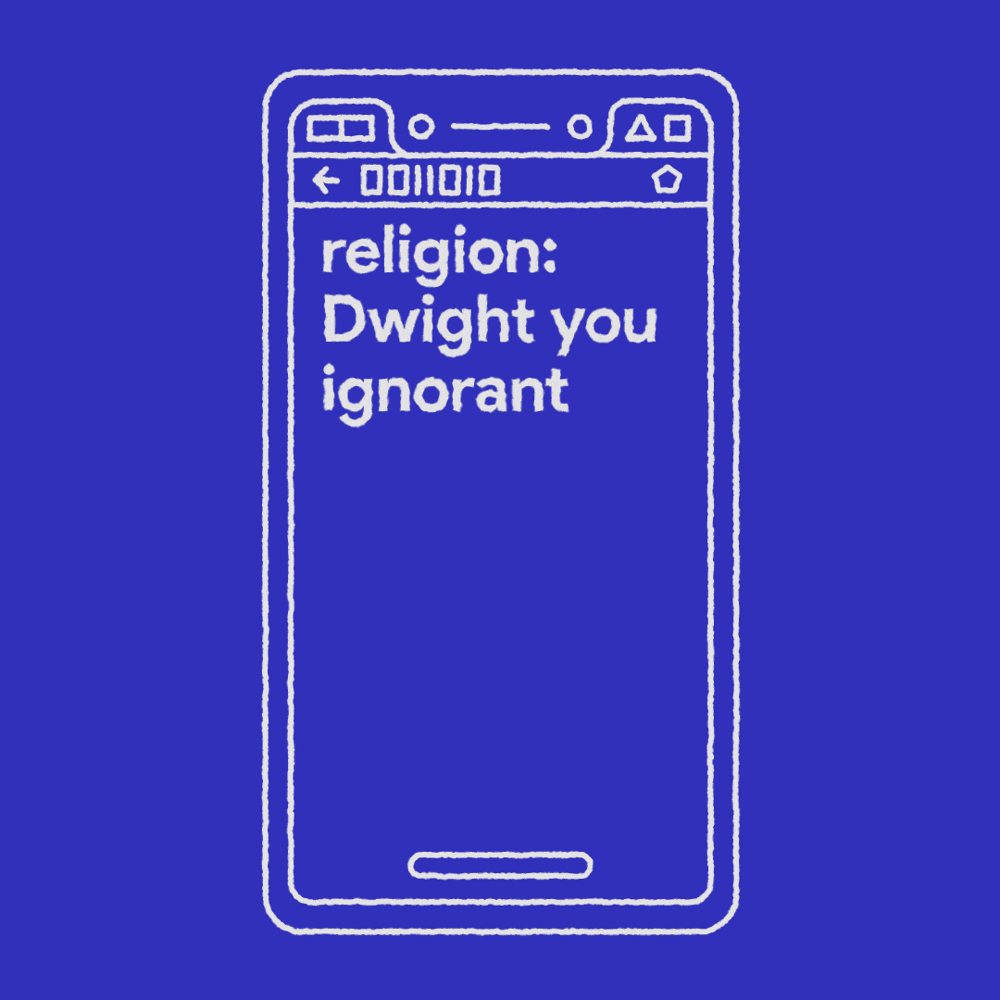
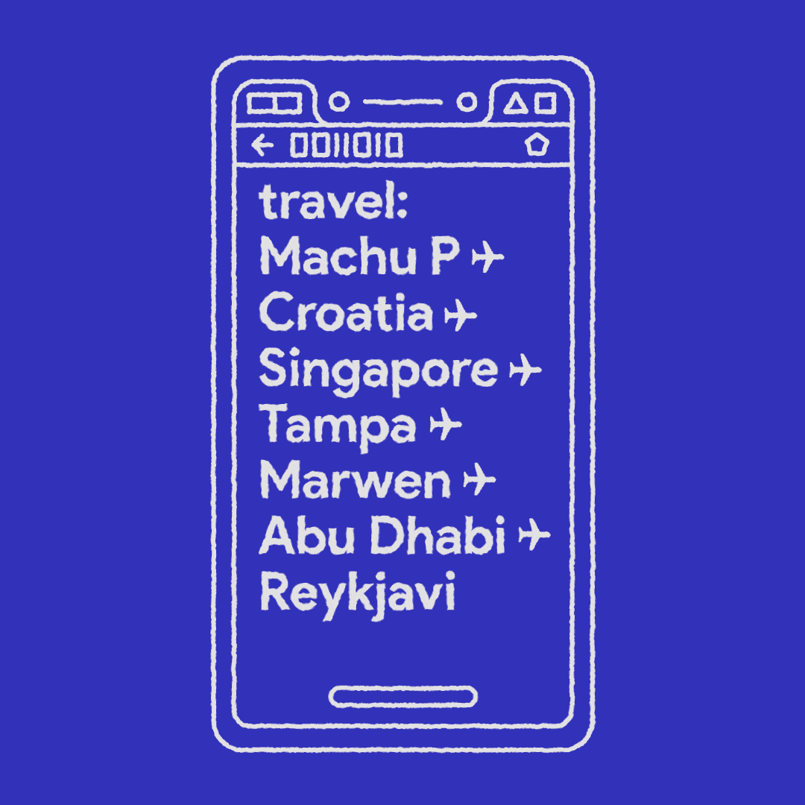
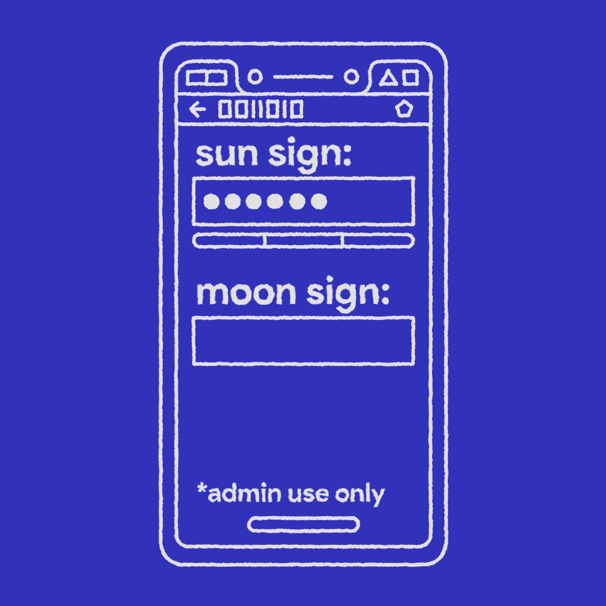
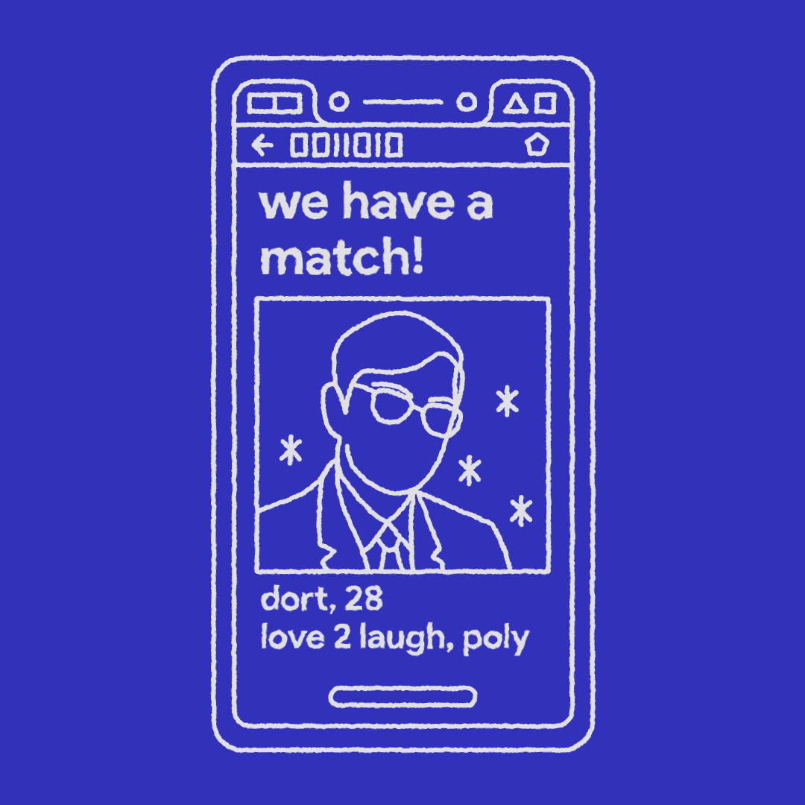
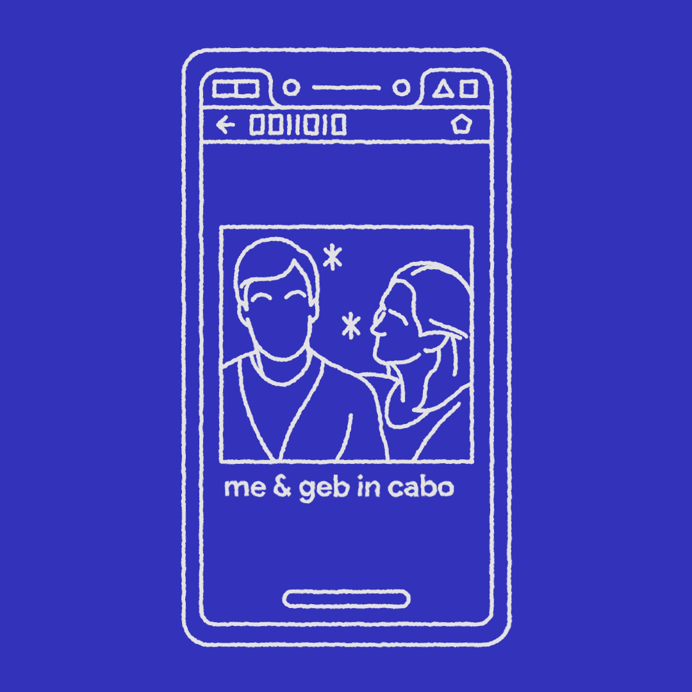
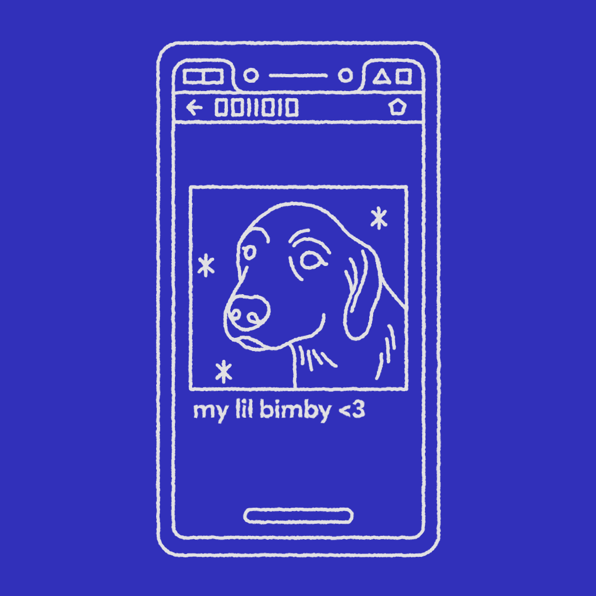
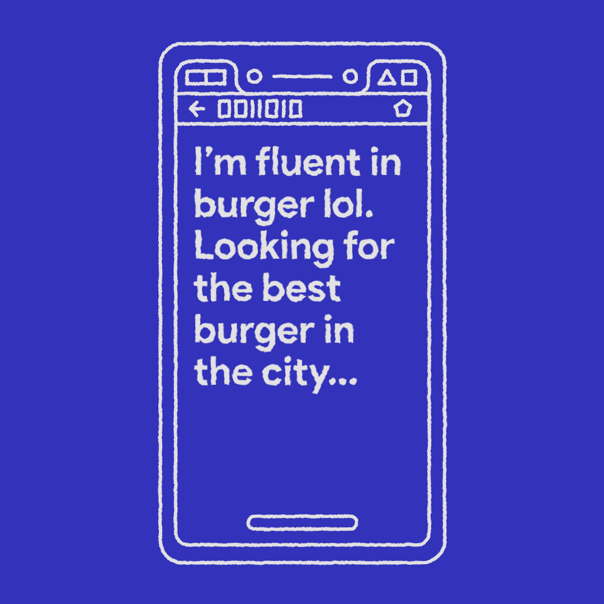
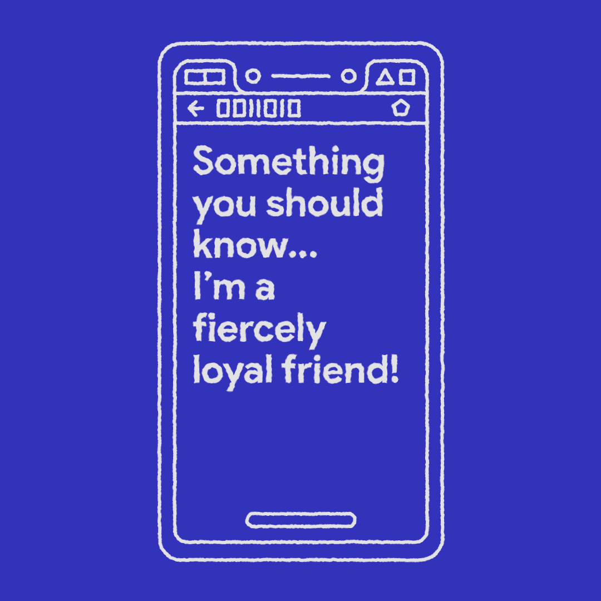

# jenny's suite of dating app features designed by patrick
presented at [Internet Exlorers](https://https://www.caveat.nyc/event/internet-explorers-2-20-2019), nyc, february 2019 with designer & animator [Patrick Hosmer](https://patrickhosmer.com)
 
---
###### my name is jenny and i work in tech...on the creative side! together w/ design lead patrick hosmer, i’ve mocked up a full suite of dating app features that i hope you like. 

 

###### first, a bio without character limit, because there shouldn’t be a cap on self expression. for users’ safety, however, if our proprietary tech detects an alphabetized list of directors, a character limit + content suggestion will go into effect.

 

###### if our ai detects a user’s bio content is >50% about the american tv show the office (nbc, 2005-2013) that user will be funneled into an online discussion board for like-minded individuals.

 

###### people love to document travel + time abroad, which makes sense bc those are 2 of the most exhilarating things a person can do. for users under 40 who’ve been geotracked by drones since birth, their drone history will autopopulate their bio with any major moves in their lifetime.

 

###### we at “jenny’s suite of dating app features designed by patrick” value users’ privacy above all else. users can trust us with their sun + moon signs, personal data we will never share.

 

###### in exchange for providing 23andme with every bit of user data available to us, we’ve partnered to offer some cool features: after a user matches with someone, and not a moment before, they’ll be able to see their ancestry match with that person!

 

###### plus, every stranger in a user’s profile photos will be bio-tagged with their relation to the user to optimize understanding + suppress curiosity.

 

###### everyone knows dogs look like their owners. which is why if our facial recognition software detects less than a 99% shared likeness between a user and any dogs in their pictures, all of the dog’s identifying features will be obscured and the user will be marked as a liar.

 

###### a lot of the problem on dating apps is that there are so many people it can be difficult to get noticed. this needs to be changed. NOW. users whose bios say they are looking to find the best burger in the city will be 150% more seen during dinner time.

 

###### finally, users who describe themselves as a "fiercely loyal friend" will be 150% more trusted than ones who do not mention how loyal of a friend they are.

 

